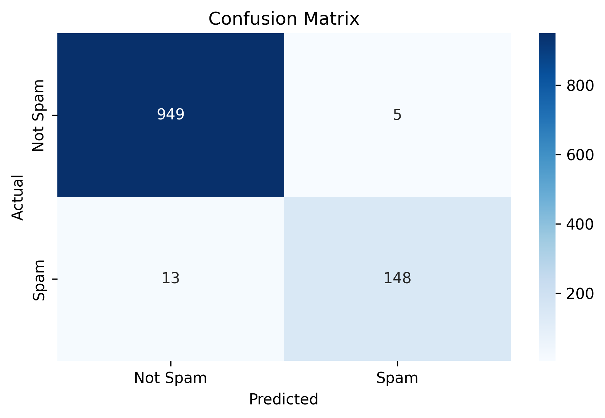
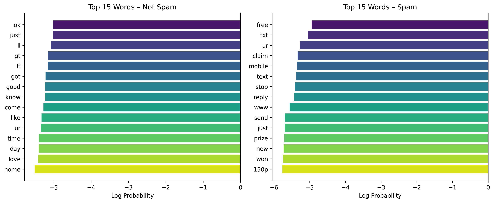
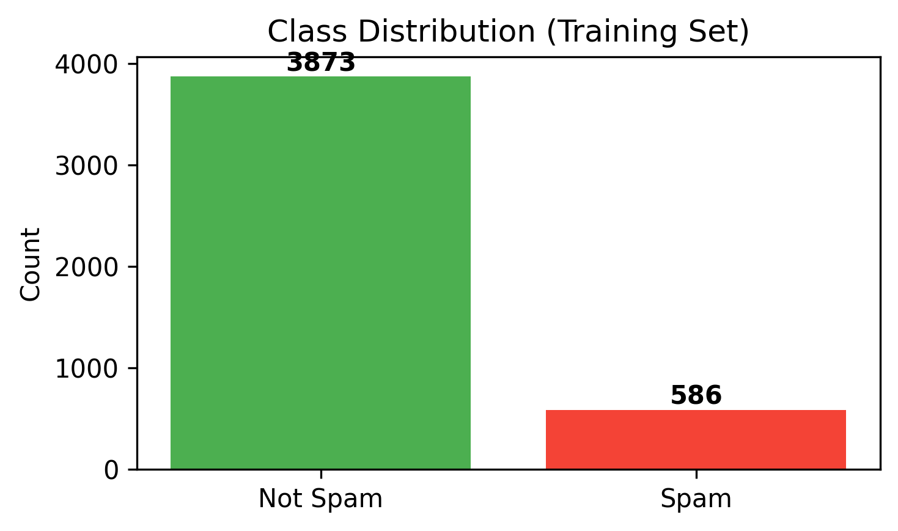
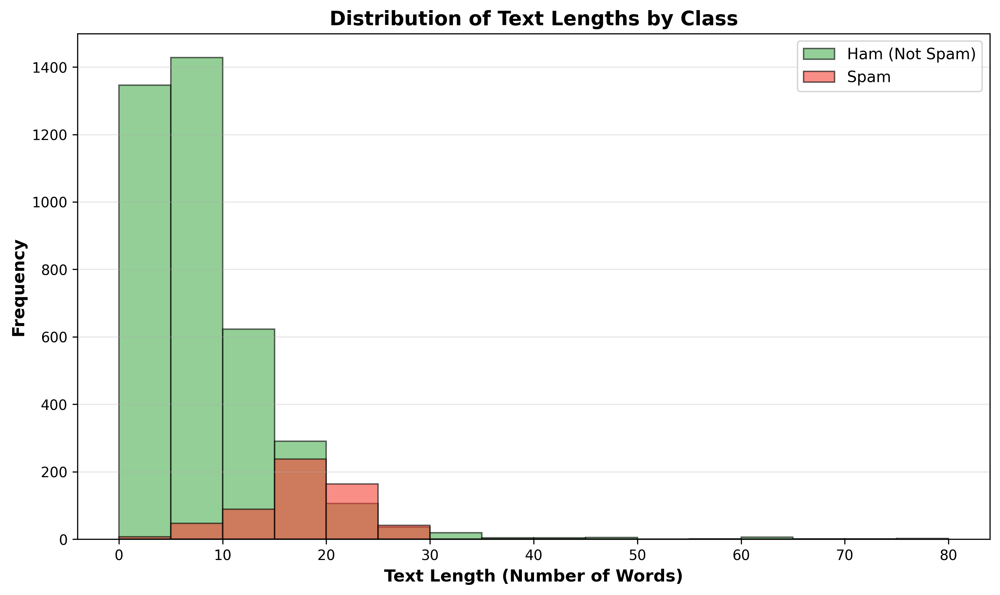

# SMS Classification Model

A machine learning project for classifying SMS messages as spam or ham (legitimate) using Natural Language Processing (NLP) techniques and a **custom-built** Multinomial Naive Bayes algorithm. This project demonstrates raw text preprocessing, feature engineering, mathematical model implementation from scratch, and advanced evaluation metrics.


## About The Project




The goal of this project is to build an effective spam classifier for SMS messages. Instead of relying on pre-built "black-box" models, the core Machine Learning algorithm (Multinomial Naive Bayes) and the optimization logic (Grid Search) were **implemented from scratch** using NumPy and Pandas. 

The system processes raw SMS text, extracts meaningful features using a Bag of Words approach, trains the custom model with Laplace Smoothing, and provides comprehensive evaluation metrics.

**Dataset Source:** [Spam SMS Classification Using NLP (Kaggle)](https://www.kaggle.com/datasets/mariumfaheem666/spam-sms-classification-using-nlp/data)

## Data Schema

The system processes the **SMS Spam Collection Dataset**. While the original dataset contained `Class` (ham/spam) and `Message` columns, we performed **Label Encoding** and column renaming during the initial preprocessing stage to prepare the data for our custom model.

**Original Mapping:**
* `ham` → `0`
* `spam` → `1`

**Current File Format:** `Spam_SMS.csv` (Processed)

~~~csv
text,label
"Ok lar... Joking wif u oni...",0
"URGENT! You have won a 1 week FREE membership in our £100,000 Prize Jackpot! Txt the word: CLAIM to ...",1
"Fine if that’s the way u feel. That’s the way its gota b",0
~~~

| Column | Type | Description | Values |
|:-------|:-----|:------------|:-------|
| `text` | TEXT | Cleaned SMS content | Any string |
| `label` | INT | Spam classification (Encoded) | 1 (Spam), 0 (Ham) |

## Key Features

### Data Preprocessing & Feature Engineering
* **Text Cleaning:** Regex-based removal of URLs, punctuation, and newline characters.
* **Stopword Removal:** Filters out common English stopwords using `sklearn.feature_extraction.text.ENGLISH_STOP_WORDS`.
* **Feature Extraction:** Compared `CountVectorizer` (Binary) and `TfidfVectorizer` to determine the best Bag of Words representation for SMS data.

### Custom Model Training (From Scratch)
* **Algorithm:** `CustomMultinomialNB` — Built strictly using `numpy` and `pandas`. Uses log-probabilities to prevent mathematical underflow.
* **Hyperparameter Tuning:** Custom `GridSearchCV` implementation to find the optimal Laplace Smoothing parameter (Alpha) using 5-fold cross-validation.

### Evaluation & Analysis
* **Explainability (Top Features):** Extracts log-probabilities from the custom model to identify the most influential words for classification.
* **Advanced Metrics:** Computes the ROC Curve and AUC Score to evaluate performance.
* **Confusion Matrix:** Analysis of prediction accuracy, emphasizing the minimization of False Positives.

## Built With
* **Language:** Python
* **Data Processing & Math:** `pandas`, `numpy`
* **Feature Engineering & Metrics:** `scikit-learn`
* **Environment:** Jupyter Notebook

### Prerequisites
* Python 3.x
* pip package manager

### Installation
1. Clone or download the repository
2. Navigate to the project directory:
   ```bash
   cd sms-classification-model
   ```
3. Create and activate a virtual environment:
   - **Windows:**
     ```bash
     python -m venv venv
     venv\Scripts\activate
     ```
   - **Mac/Linux:**
     ```bash
     python3 -m venv venv
     source venv/bin/activate
     ```
4. Install dependencies:
   ```bash
   pip install -r requirements.txt
   ```

## Usage
### Interactive Notebook

For interactive exploration, use the notebook:

```bash
jupyter notebook notebooks/spam_classifier.ipynb
```

## Configuration

### Preprocessing settings (`src/preprocessing.py`)

```python
vectorizer = CountVectorizer(max_features=5000, binary=True)
```

### Model settings (`src/model_logic.py`)

```python
param_grid = {
    'alpha': [0.01, 0.1, 0.5, 1.0, 2.0, 5.0, 10.0],
    'fit_prior': [True, False]
}
```

## Visualization Outputs

### Confusion Matrix


### Top Features per Class


### Class Distribution



### Text Length Distribution



## Troubleshooting

* **ModuleNotFoundError: No module named 'src'**
  - Ensure you are running the scripts or Jupyter notebook from the root directory of the project.
* **FileNotFoundError: Dataset files not found**
  - Verify that `Spam_SMS.csv` is correctly placed inside the `data/` directory.
* **Memory Errors**
  - If vectorization exhausts memory, reduce `max_features` in `src/preprocessing.py`.
* **Requirements Installation Fails**
  - Make sure you are in the directory containing `requirements.txt`. Note: `re` and `string` are built-in Python modules and do not need to be installed.

## Project Structure

```text
sms-classification-model/
├── data/
│   └── Spam_SMS.csv                # SMS Dataset (~5,574 messages)
├── src/
│   ├── data_loader.py              # Data loading utilities
│   ├── preprocessing.py            # Text preprocessing & vectorization
│   ├── model_logic.py              # Custom Model & GridSearch logic
│   └── eval_plots.py               # Metrics and visualizations logic
├── notebooks/
│   └── spam_classifier.ipynb       # Main Jupyter Notebook
├── class_distribution.png          # Generated visualization
├── confusion_matrix.png            # Generated visualization
├── text_length_distribution.png    # Generated visualization
├── top_features.png                # Generated visualization
├── requirements.txt                # Python dependencies
└── README.md                       # Project documentation
```

## Acknowledgements
* Dataset originally compiled and provided by **Marium Masroor** on Kaggle.
* Thanks to the scikit-learn community for their comprehensive ML documentation.
* Matplotlib and Seaborn for data visualization capabilities.
* The open-source Python community for their extensive libraries and resources.

## License
This project is licensed under the MIT License. It was developed as a final academic assignment for a Machine Learning course.
