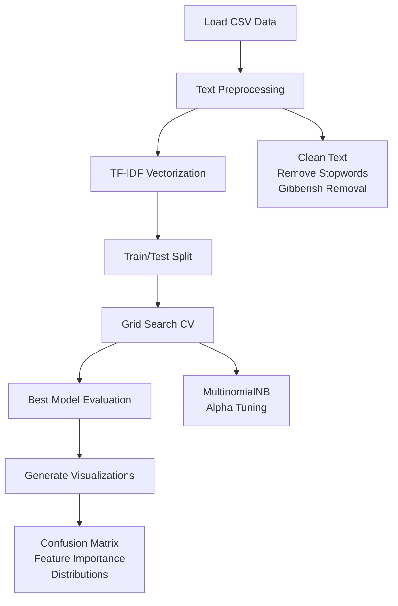

# Email Classification Model

A machine learning project for classifying emails as spam or not spam using Natural Language Processing (NLP) techniques and the Multinomial Naive Bayes algorithm. This project demonstrates text preprocessing, feature extraction, model training, and evaluation on a real-world email dataset.

## About The Project


The goal of this project is to build an effective spam email classifier using machine learning. By implementing text preprocessing techniques like cleaning, stopword removal, and TF-IDF vectorization, combined with a probabilistic classifier, the model achieves high accuracy in distinguishing between legitimate emails and spam.

The system processes raw email text, extracts meaningful features, trains a Naive Bayes model with hyperparameter tuning, and provides comprehensive evaluation metrics and visualizations to understand model performance and feature importance.

## Project Structure

- `data/` — Contains the training and test datasets
  - `spam_train_10000.csv` — Training dataset with 10,000 emails
  - `spam_test_1000.csv` — Test dataset with 1,000 emails
- `src/` — Source code modules
  - `data_loader.py` — Loads and handles dataset files
  - `preprocessing.py` — Text cleaning and feature extraction
  - `model_logic.py` — Model training and evaluation
  - `eval_plots.py` — Evaluation metrics and visualization functions
- `main.py` — Main script to run the entire pipeline
- `plots/` — Generated visualizations (created after running main.py)
  - `confusion_matrix.png` — Confusion matrix heatmap
  - `top_features.png` — Top words per class bar charts
  - `class_distribution.png` — Class distribution bar chart
  - `text_length_distribution.png` — Text length histograms
- `requirements.txt` — Python dependencies
- `README.md` — Project documentation

## 📊 Data Schema

The email classification system uses CSV files for data storage. The datasets contain raw email text and binary labels.

**File Format:** `spam_train_10000.csv` / `spam_test_1000.csv`

```csv
text,label
"Congratulations! You won a tablet. Click here to claim now GeNkKkxn",Spam
"Happy Birthday! Have a great year ahead 2cS1N1R7",Not Spam
"Can you send me the project files? TSldiSa0",Not Spam
```

| Column | Type | Description | Values |
|:-------|:-----|:------------|:-------|
| `text` | TEXT | Raw email content | Any string |
| `label` | TEXT | Spam classification | "Spam", "Not Spam" |

The system processes this raw text through multiple preprocessing steps before feature extraction and model training.

## Key Features

### Data Preprocessing
* **Text Cleaning:** Lowercasing, punctuation removal, gibberish detection
* **Stopword Removal:** Filters out common English stopwords using NLTK
* **Feature Extraction:** TF-IDF vectorization with 5000 max features
* **Label Encoding:** Converts text labels to binary (0: Not Spam, 1: Spam)

### Model Training
* **Algorithm:** Multinomial Naive Bayes classifier
* **Hyperparameter Tuning:** Grid search on alpha parameter with 5-fold CV
* **Evaluation Metrics:** Accuracy, Precision, Recall, F1-Score
* **Cross-Validation:** 5-fold stratified cross-validation for robust evaluation

### Visualization & Analysis
* **Confusion Matrix:** Heatmap showing prediction accuracy breakdown
* **Feature Importance:** Top words per class from Naive Bayes probabilities
* **Class Distribution:** Bar chart of spam vs non-spam in training data
* **Text Length Analysis:** Histograms comparing email lengths by class

## Built With

* **Language:** Python 3.14
* **Machine Learning:** scikit-learn (Naive Bayes, GridSearchCV, TF-IDF)
* **Data Processing:** pandas, numpy
* **Natural Language:** NLTK (stopwords)
* **Visualization:** matplotlib, seaborn
## Getting Started

### Prerequisites
* Python 3.x
* pip package manager

### Installation
1. Clone or download the repository
2. Navigate to the project directory:
   ```bash
   cd email-classification-model
   ```
3. Install dependencies:
   ```bash
   pip install -r requirements.txt
   ```

## Usage

### Running the Complete Pipeline
Execute the main script to run data loading, preprocessing, training, evaluation, and visualization generation:

```bash
python main.py
```

This will:
- Load training and test datasets
- Preprocess email text (cleaning, vectorization)
- Train Multinomial Naive Bayes with hyperparameter tuning
- Evaluate model performance on test set
- Generate and save visualizations in the `plots/` directory

### Expected Output
```
Datasets loaded successfully!
Preprocessing text...
Vectorizing data...
Training model...
Starting Grid Search for optimization (CV=5)...
Optimization complete! Best params: {'alpha': 0.1}

Train Result (Optimized Model):
Accuracy:  0.9785
Precision: 0.9832
Recall:    0.9501
F1-Score:  0.9663

Test Result (Optimized Model):
Accuracy:  0.9720
Precision: 0.9781
Recall:    0.9432
F1-Score:  0.9603

Test Metrics:
========================================
Evaluation Results
========================================
Accuracy:  0.9720
Precision: 0.9781
Recall:    0.9432
F1 Score:  0.9603
========================================
              precision    recall  f1-score   support

           0       0.97      0.99      0.98       715
           1       0.98      0.94      0.96       285

    accuracy                           0.97      1000
   macro avg       0.97      0.97      0.97      1000
weighted avg       0.97      0.97      0.97      1000

Generating visualizations...
Visualizations saved in plots/
```

## ⚙️ Configuration

You can adjust model parameters directly in the source files:

**Preprocessing Configuration** (`src/preprocessing.py`):
```python
# TF-IDF Vectorizer settings
vectorizer = TfidfVectorizer(max_features=5000)  # Adjust max_features for vocabulary size
```

**Model Configuration** (`src/model_logic.py`):
```python
# Hyperparameter grid for GridSearchCV
param_grid = {
    'alpha': [0.01, 0.1, 0.5, 1.0, 2.0, 5.0, 10.0]  # Smoothing parameters to try
}
```

**Visualization Configuration** (`main.py`):
```python
# Number of top features to display
n=15  # Adjust for more/less top words
```

## 📈 Visualizations

After running `main.py`, the following visualizations are generated:

### 1. Confusion Matrix


Shows the number of true positives, true negatives, false positives, and false negatives. Helps understand the model's classification performance and identify areas for improvement.

### 2. Top Features per Class


Displays the most indicative words for spam and non-spam emails based on log probabilities from the Naive Bayes model. Useful for understanding what features the model considers important for classification.

### 3. Class Distribution


Bar chart showing the distribution of spam vs non-spam emails in the training set. Helps identify class imbalance issues that may affect model training.

### 4. Text Length Distribution


Overlapping histograms comparing text lengths between spam and non-spam emails. Can reveal patterns in email content length that correlate with spam classification.

## 🔧 Pipeline Flow Diagram



## 🔧 Troubleshooting

Common issues and solutions:

* **ModuleNotFoundError: No module named 'src'**
  - Ensure you're running `python main.py` from the project root directory
  - Check that all files in `src/` exist

* **FileNotFoundError: Dataset files not found**
  - Verify that `data/spam_train_10000.csv` and `data/spam_test_1000.csv` exist
  - Ensure the data files are not corrupted

* **NLTK Stopwords Download Error**
  - The code automatically downloads NLTK stopwords on first run
  - If download fails, manually run: `python -c "import nltk; nltk.download('stopwords')"`

* **Memory Error during Vectorization**
  - Reduce `max_features` in `preprocessing.py` if you have limited RAM
  - Process data in smaller batches if needed

* **Poor Model Performance**
  - Check class distribution for imbalance
  - Try different alpha values in the parameter grid
  - Consider increasing `max_features` for more vocabulary

* **Plots not displaying correctly**
  - Ensure matplotlib and seaborn are properly installed
  - Check that the `plots/` directory has write permissions

## 📂 Project Structure

```
email-classification-model/
├── data/
│   ├── spam_train_10000.csv    # Training dataset
│   └── spam_test_1000.csv      # Test dataset
├── src/
│   ├── data_loader.py          # Data loading utilities
│   ├── preprocessing.py        # Text preprocessing & vectorization
│   ├── model_logic.py          # Model training & evaluation
│   └── eval_plots.py           # Visualization functions
├── plots/                      # Generated visualizations
│   ├── confusion_matrix.png
│   ├── top_features.png
│   ├── class_distribution.png
│   └── text_length_distribution.png
├── main.py                     # Main execution script
├── requirements.txt            # Python dependencies
├── README.md                   # Project documentation
└── .gitignore                  # Git ignore rules
```

## Acknowledgments

* Dataset source: Email spam classification dataset
* Inspired by the need to understand NLP and machine learning fundamentals
* Thanks to the scikit-learn community for comprehensive ML documentation
* NLTK project for natural language processing tools
* Matplotlib and Seaborn for data visualization capabilities
* Python community for extensive libraries and resources

## License

This project is licensed under the MIT License - see the [LICENSE](LICENSE) file for details.
